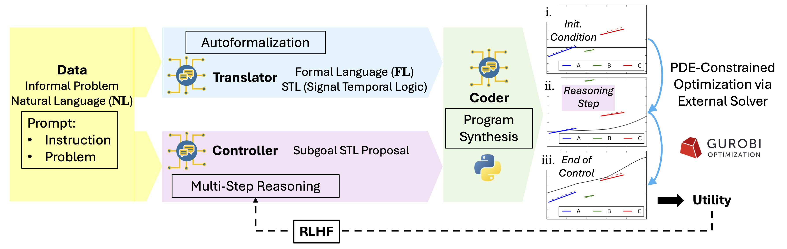
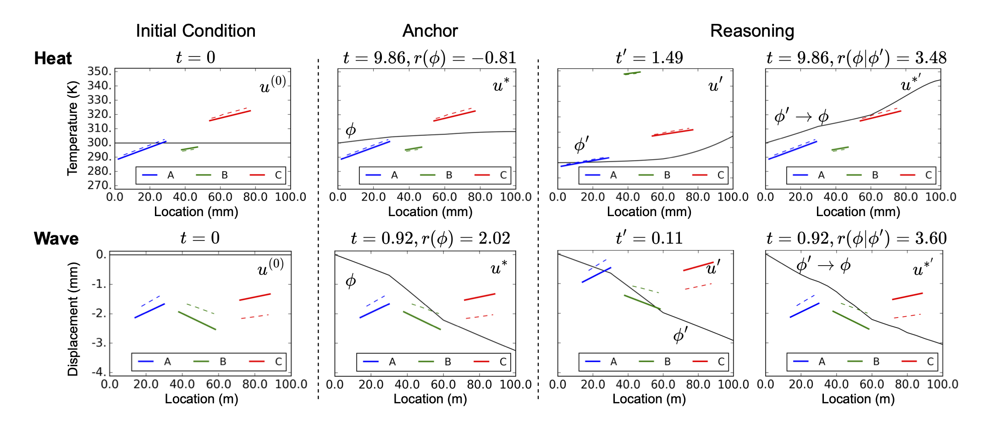

# PDE-Controller

This repository contains the implementation for [PDE-Controller: LLMs for Autoformalization and Reasoning of PDEs](http://arxiv.org/abs/2502.00963)

<br>
<div align="center">
    
</div>

<p align="center">
        🤗 <a href="https://huggingface.co/datasets/delta-lab-ai/pde-controller">Hugging Face Datasets</a>&nbsp&nbsp | &nbsp&nbsp 📑 <a href="http://arxiv.org/abs/2502.00963">Paper</a> &nbsp&nbsp ｜ &nbsp&nbsp📖 <a href="https://pde-controller.github.io/">Project Page</a>
</p>

## Dataset and Models
Our datasets, are released at [Hugging-face](https://huggingface.co/datasets/delta-lab-ai/pde-controller).

 <!-- This includes:
* TODO list the datasets -->


The PDE-Controller models are as follows:

|Model Name|Huggingface Link|
|:--|:--|
|Translator|🤗 [link](https://huggingface.co/delta-lab-ai/translator)|
|Coder|🤗 [link](https://huggingface.co/delta-lab-ai/coder)|
|Controller|🤗 [link](https://huggingface.co/delta-lab-ai/controller)|
|Fine-tuned Coder for Controller|🤗 [link](https://huggingface.co/delta-lab-ai/finetuned_coder)|


## Introduction

We present [PDE-Controller](http://arxiv.org/abs/2502.00963), a framework that enables large language models (LLMs) to control systems governed by partial differential equations (PDEs). Traditional LLMs have excelled in commonsense reasoning but fall short in rigorous logical reasoning. While recent AI-for-math has made strides in pure mathematics, areas of applied mathematics, particularly PDEs, remain underexplored despite their significant real-world applications. Our approach enables LLMs to transform informal natural language instructions into formal specifications, and then execute reasoning and planning steps to improve the utility of PDE control. We build a holistic solution comprising datasets (both human-written cases and 2 million synthetic samples), math-reasoning models, and novel evaluation metrics, all of which require significant effort. Our PDE-Controller significantly outperforms the latest open-source and GPT models in reasoning, autoformalization, and program synthesis, achieving up to a 62% improvement in utility gain for PDE control. By bridging the gap between language generation and PDE systems, we demonstrate the potential of LLMs in addressing complex scientific and engineering challenges.

<br>
<div align="center">
    
</div>

## Case Study

An example of LLM reasoning for PDE control on heat (top) and wave (bottom) problems.


<br>
<div align="center">
    
</div>

## Installation
For training only the `trainenv` environment is required. For testing the `trainenv` environment will work to obtain model outputs. In order to simulate utilities with the Gurobi optimizer and the Femformal repository in Python 2, an additional environment, `pdecontrol`, is required. Only `trainenv` need to be activated to run the code, activating `pdecontrol` will be done by the [main test script](./test/PDEcontrol/evaluation/infer/run_1d_pdecontrol_eval_full.py)

## Training and Testing in python 3
Create a conda environment:

```shell
conda create -n trainenv python=3.10
```

Activate the environment:

```shell
conda activate trainenv
```

Run the commands in `environment.sh` to install the required packages.


<!-- ## Testing with python 2 and Gurobi
Create a conda environment:

```shell
TODO
``` -->

<!-- ## Data Processing

The documentations for generating each part of the datasets:

TODO -->

## Training

The documentation for training is at: [training](train/README.md)

## Testing

The documentation for testing is at: [evaluation](test/README.md).

## Citation

If you find this repository helpful, please consider citing our paper:

```
@article{soroco2025pdecontroller,
  title={PDE-Controller: LLMs for Autoformalization and Reasoning of PDEs},
  author={Soroco, Mauricio and Song, Jialin and Xia, Mengzhou and Emond, Kye and Sun, Weiran and Chen, Wuyang},
  journal={arXiv preprint arXiv:2502.00963},
  year={2025}
}
```